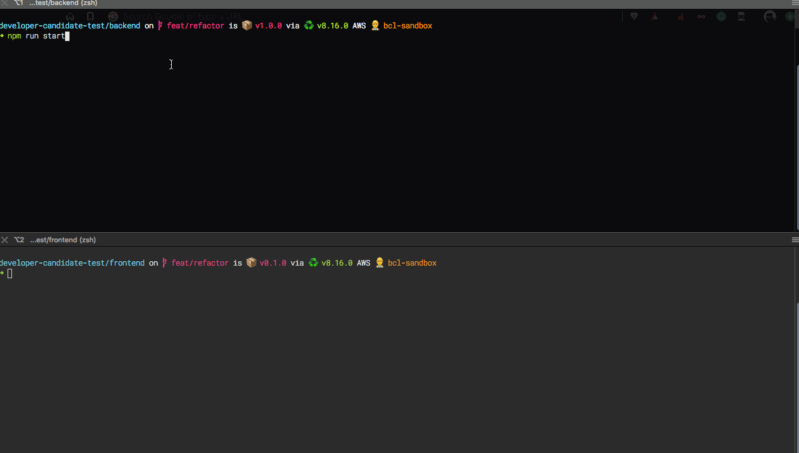

# refactionjs

Refactoring and showcase exercise for JavaScript (solved)

To run:

First run the [backend](backend/README.md): 

- `cd backend/`
- `npm i`
- `npm run start`

See the [backend README](backend/README.md) for further info. 

In a separate command prompt, run the [frontend](frontend/README.md): 

- `cd frontend/`
- `npm i`
- `npm run start`
- Visit [http://localhost:3000](http://localhost:3000) in your browser. 

See the [frontend README](frontend/README.md) for further info. Also have a look at [this](botched-frontend/README.md) for a failed attempt with some missing features. 
